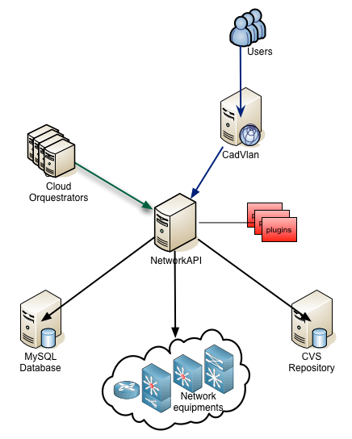

About Globo NetworkAPI 
######################

Description
***********

Globo NetworkAPI is a REST API that manages IP networking resources. It is supposed to be not just an IPAM, but a centralized point of network control, allowing documentation from physical and logical network and starting configuration requests to equipments.

Globo NetworkAPI is made to support a Web User Interface features, exposing its funcionality to be used with any other client.

This web tool helps network administrator manage and automate networking resources (routers, switches and load balancers) and document logical and physical networking.

They were created to be vendor agnostic and to support different orquestrators and environments without loosing the centralized view of all network resources allocated.

It was not created to be and inventory database, so it does not have CMDB functionalities.

You can find documentation for the Web UI `in this link <http://globonetworkapi-webui.readthedocs.org>`_.

Features
********

* LDAP authentication
* Supports cabling documentation (including patch-panels/DIO's)
* Separated Layer 2 and Layer 3 documentation (vlan/network)
* IPv4 and IPv6 support
* Automatic allocation of Vlans, Networks and IP's
* ACL (access control list) automation (documentation/versioning/applying)
* Load-Balancer support
* Automated deploy of allocated resources on switches, routers and load balancers
* Load balancers management
* Expandable plugins for automating configuration

Architecture
************

.. _architecture-img_ref:

Related Projects
****************

`Globo NetworkAPI WebUI <https://github.com/globocom/GloboNetworkAPI-WebUI>`_.

`Globo NetworkAPI Python Client <https://github.com/globocom/GloboNetworkAPI-client-python>`_.

`Globo NetworkAPI Python Java <https://github.com/globocom/GloboNetworkAPI-client-java>`_.

