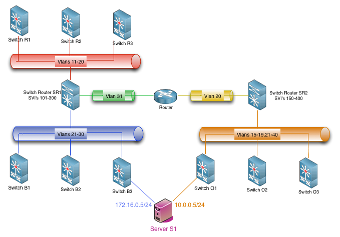
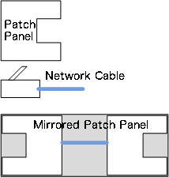
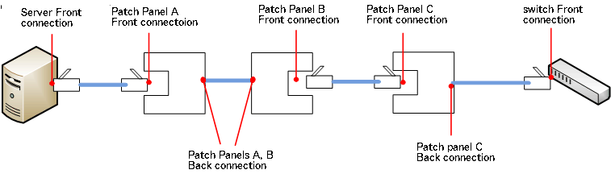

Definitions
#############

.. contents::
   :depth: 5

.. access_ref:

Access
--------

Access is used to configure the protocol and username/password used for accessing :ref:`equipment_ref`. Plugins can use these informations in order to get credencials for listing and configuring :ref:`equipment_ref`.

You can insert many different protocols for each :ref:`equipment_ref`, like telnet, ssh, snmp etc.

.. _administrative_permission_ref:

Administrative Permission
-------------------------

Security functions that are used to allow administrative system functions or equipment configuration functions. These permissions are configured per :ref:`user_group_ref`.

Notice that in order to do equipment configuration functions, the :ref:`user_group_ref` has to have the respective administrative permission AND permissions on the :ref:`equipment_group_ref`.

.. _brand_ref:

Brand
-----

Used for categorizing the equipments of a specific vender/brand name.

.. _environment_ref:

Environment
-----------

The environment defines a logical part of the infrastructure, usually a broadcast domain. It can be divided in 3 parts: "Divisao_DC", "Ambiente Logico" and "Grupo Layer3". It is expected to have all vlans in a environment routed in the same gateway/router.

I.e. In the picture below, you can see 5 different envinronments, represented by different colors:

* The Red has vlan range from 11 to 20 and :ref:`equipment_ref` R1, R2, R3 and SR1. 
* The Blue has vlan range from 21 to 30 and :ref:`equipment_ref` B1, B2, B3 and SR1.
* The Green has vlan 31 and :ref:`equipment_ref` SR1 and Router.
* The Yellow has vlan 20 and :ref:`equipment_ref` SR2 and Router.
* The Orange has vlan ranges from 15 to 19 and from 21 to 40, and :ref:`equipment_ref` O1, O2 and O3 and SR2.

.. _environments-img_ref:

   *example topology*

Notice that, as you have a common equipment SR1 in 3 environments Red, Green and Blue, you cannot have vlan numbers that overlaps in them. The same applies to Yellow and Orange environments.

As Orange and {Red, Green an Blue} have no equipments in common, they can have vlans that shares the same numbers.

This is automatically considered by Globo NetworkAPI when you configure your environments and their :ref:`equipment_ref`.

You can also have a server like S1 that needs to connect to more than environment. In this cases, you have to configure a :ref:`filter_ref` for those environments.

.. _equipment_ref:

Equipment
---------

Equipment represents any object in the infrasctructure that has to be documented. Routers, switches, patch panels, servers, load balancers, virtual servers etc. Equipments have a type, a "brand" and a "model" in order to categorize it. They can also be arranged in :ref:`equipment_group_ref`.

Equipments can have :ref:`IP_ref` and :ref:`interface_ref` and can be associated with an :ref:`environment_ref`.

In :ref:`environments-img_ref` above, server *S1* has IPs *172.16.0.5* and *10.0.0.5* and is part of 2 environments, Blue and Orange. Switch B1 does not have any IP address, but it is part of Blue environment. SR1 may have hundreds of IPs and it is part of 3 environments.

.. _equipment_group_ref:

Equipment Group
---------------

Equipment Group is used for access restrictions on :ref:`equipment_ref`.

In order to be able to read/write configurations for an :ref:`equipment_ref`, a :ref:`user_ref` has to be in a :ref:`user_group_ref` that has the necessary permissions in at least one Equipment Group that the specific :ref:`equipment_ref` is part of.

So, in order to be managed, an :ref:`equipment_ref` has to be part of at least one Equipment Group.

.. _equipment-type_ref:

Equipment Type
---------------

This is field for categorizing the :ref:`equipment_ref`. It is also used in :ref:`filter_ref`.

.. _filter_ref:

Filter
-------

Filters are used to permit an :ref:`equipment_ref` of a specific :ref:`equipment-type_ref` to be part of more than one :ref:`environment_ref` that has overlapping vlans and/or networks.

In the :ref:`environments-img_ref` above, server S1 should be part of two environments that have overlapping vlan numbers. In this case, there should have a filter that has the server S1 :ref:`equipment-type_ref` applied in both environments, Blue and Orange. It is recommended not to create filters with switches or routers.

.. _ip_ref:

IP (IPv4/IPv6)
--------------

Represents the IPs allocated for every :ref:`equipment_ref` in a specific :ref:`network_ref`. You can allocate the same IP to more than one :ref:`equipment_ref` in the same network (clusters, gateway redundancy protocols etc). There is no limit on the number of IPs an :ref:`equipment_ref` can have (if available in :ref:`network_ref`).

The allocated IPs are used for documentation pourposes and for automatic allocating of newly unused IPs.

.. _interface_ref:

Interface
----------

Represents the physical interfaces that :ref:`equipment_ref` may have and the connections between them.

* You can represent patch panels in 2 ways. Generic patch panel or mirrored patch panel. When 2 patch panels are connected by their back connections in a organized way (the same interface numbers are correlated), you can represent them as a single :ref:`equipment_ref`, a mirrored patch panel. In other cases, you can represent each panel as a separated :ref:`equipment_ref`, like a generic patch panel.

* Patch panels has for each interface, 2 connections. The "Front" and "Back" connection. You can define each side as you want.

* Only patch panels have "Back" connections. All other equipments should have only "Front" connections.

Figure below show some examples of physical interfaces:

.. _models-img_ref:

   *example interfaces*

.. _connections_mirrored-img_ref:

.. figure:: diagrams/connections_mirrored.gif

   *example connections with a mirrored patch panel*

.. _connections_generic-img_ref:

   *example connections with generic patch panels*

Some equipments may have a front and back connection (i.e. patch panel) and some equipments only have 1 possible connection (ie network interface card on servers, switch interfaces etc).

Interfaces are used for documentation pourposes and to locate a switch port that a specific server is configured when you want to change that server inteface configuration on switch side. Interfaces that should not be configured in any case by the system should be configured with "protected" flag.

.. _model_ref:

Model
-----

Each :ref:`brand_ref` can have several models. The models are used for documenting purposes. 

.. _network_ref:

Network
-------

Represent the layer 3, IPv4 or IPv6 address range.

As it is a different layer, althought not recommended by IP networking best practices, you can have multiple IPv4/IPv6 networks in the same :ref:`vlan_ref`.

As :ref:`vlan_ref` and :ref:`environment_ref`, you cannot have two overlapping networks (same length or subnets/supernets) in the same environment. The equipments should not be able to treat that, but you can have those in different environments. I.E. in picture :ref:`environments-img_ref` you cannot have overlapping networks 172.16.0.0/24 and 172.16.0.128/25 in Blue, Red or Green environment at the same time, because the same switch router supports all Layer3, but you can have 172.16.0.0/24 on Blue and 172.16.0.128/25 on Orange environment for example.

.. _network_type_ref:

Network Type
------------

Used for documentating purposes only. You can for example tell that :ref:`network_ref` of a specific type are used for point-to-point links, or for internal usage only, networks for NAT only etc.

.. _plugin_ref:

Plugin (Roteiro)
----------------

The files used by the :ref:`script_ref` for performing a task on specific :ref:`equipment_ref`. Each plugin have a type to be categorized. You can write your scripts and how they look for your plugins, but is recommended that the plugin name be the file name used.

The plugin type is used for calling the correct :ref:`script_ref` in order to do that type of configuration.

.. _script_ref:

Scripts
-------

You can create scripts for doing anything in your environment. We recommend making them for a generic feature, and call a :ref:`plugin_ref` from them to make equipment/brand specific syntax commands.

You associate a script with a specific :ref:`plugin_ref` type and associate the :ref:`plugin_ref` of that type to the :ref:`equipment_ref`. This way you can perform several tasks on different :ref:`equipment_ref` brands/models with the same plugin.

.. _template_ref:

Template (ACL)
--------------

When you configure an :ref:`environment_ref`, you can define a base model for the access lists (ACL) for every interface vlan (SVI) that you create there. This model is the template. It is a text file with keywords that are replaced with the network/Ips created for those networks.

You can define a template for IPv4 and another for IPv6 :ref:`network_ref` for each :ref:`environment_ref`.

.. _user_ref:

User
----

An account for a client to authenticate. You can use a locally stored password or configure to use LDAP authentication.

.. _user_group_ref:

User Group
----------

:ref:`user_ref` groups used for access restriction. All permissions are based on user groups. There is no way to give a permission directly to a :ref:`user_ref`.

.. _vlan_ref:

Vlan
----

Represent the layer 2 Vlans on equipments. See :ref:`environment_ref` for restrictions on vlan numbering.

